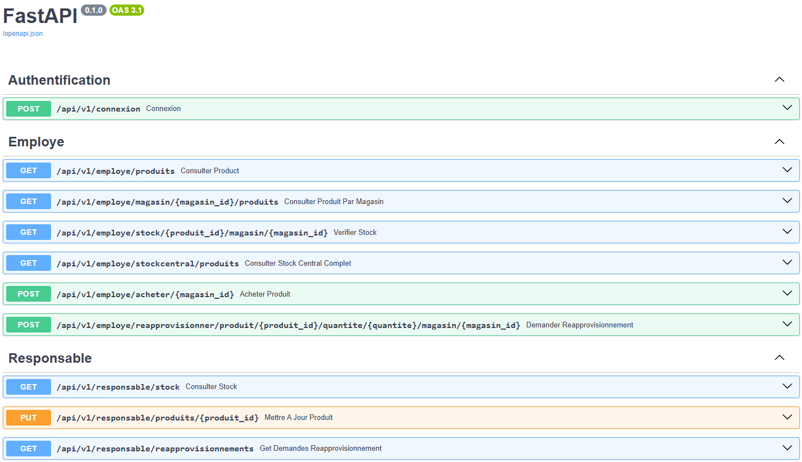
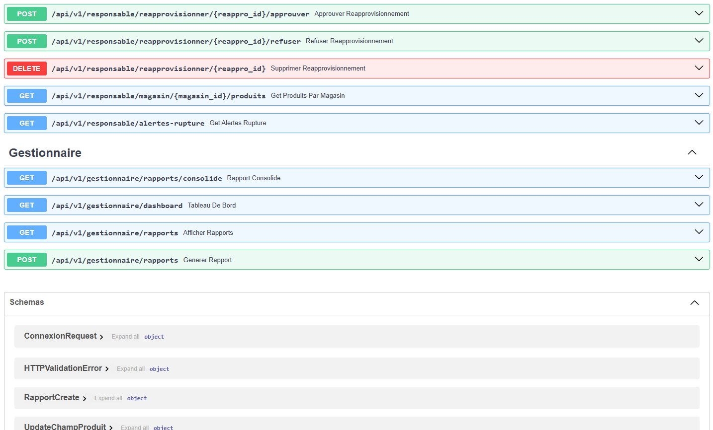
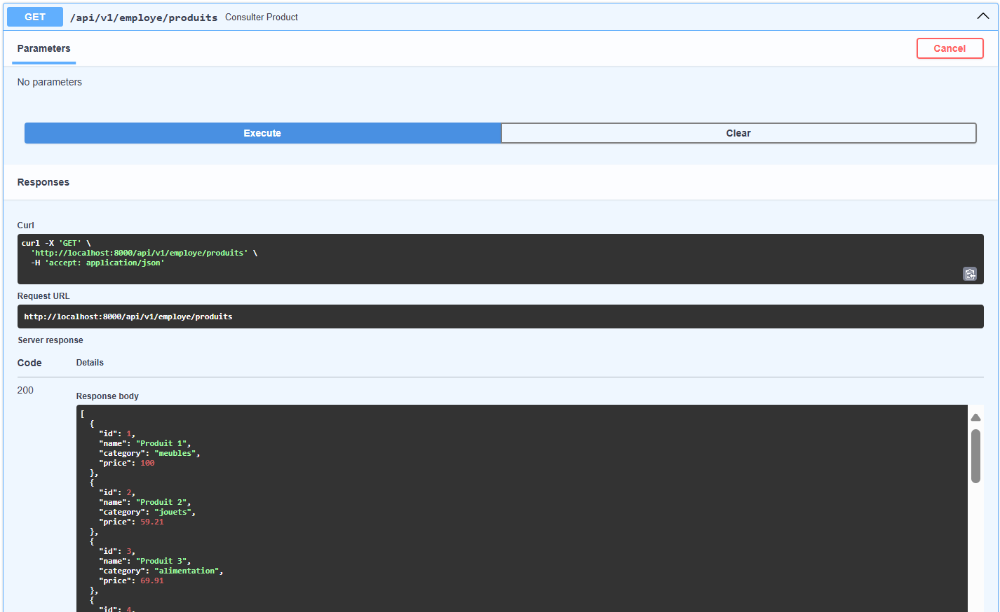

## Authentification (`/connexion`)

| Méthode | Endpoint     | Description                                         | Requête                                      | Réponse (succès)     | Codes    |
| ------- | ------------ | --------------------------------------------------- | -------------------------------------------- | -------------------- | -------- |
| POST    | `/connexion` | Authentifie un utilisateur avec nom et mot de passe | `{ "nom": "alice", "mot_de_passe": "1234" }` | JWT + rôle + message | 200, 401 |

---

## Produits

| Méthode | Endpoint                                   | Description                                | Paramètres / Corps | Réponse                    | Codes    |
| ------- | ------------------------------------------ | ------------------------------------------ | ------------------ | -------------------------- | -------- |
| GET     | `/produits`                                | Liste des produits disponibles             | —                  | `[ {id, name, price} ]`    | 200      |
| GET     | `/magasin/{id}/produits`                   | Liste des produits d’un magasin spécifique | `id = magasin_id`  | produits avec quantité     | 200, 404 |
| GET     | `/stock/{produit_id}/magasin/{magasin_id}` | Stock d’un produit dans un magasin         | dans l’URL         | produit, magasin, quantité | 200, 404 |

---

## Achats

| Méthode | Endpoint                | Description                       | Corps JSON                               | Réponse                 | Codes    |
| ------- | ----------------------- | --------------------------------- | ---------------------------------------- | ----------------------- | -------- |
| POST    | `/acheter/{magasin_id}` | Effectue un achat dans un magasin | `[ { "produit_id": 1, "quantite": 3 } ]` | Confirmation ou erreurs | 200, 400 |

---

## Réapprovisionnement

| Méthode | Endpoint                                                                 | Description                    | Corps JSON ou params | Réponse      | Codes         |
| ------- | ------------------------------------------------------------------------ | ------------------------------ | -------------------- | ------------ | ------------- |
| POST    | `/reapprovisionner/produit/{produit_id}/quantite/{qte}/magasin/{mag_id}` | Demande de réapprovisionnement | —                    | Message      | 200, 404      |
| GET     | `/reapprovisionnements`                                                  | Liste des demandes en attente  | —                    | Liste        | 200           |
| POST    | `/reapprovisionner/{id}/approuver`                                       | Approuve une demande           | —                    | Confirmation | 200, 400, 404 |
| POST    | `/reapprovisionner/{id}/refuser`                                         | Refuse une demande             | —                    | Message      | 200, 400, 404 |
| DELETE  | `/reapprovisionner/{id}`                                                 | Supprime une demande           | —                    | Message      | 204, 404      |

---

## Gestion des Produits (par gestionnaire)

| Méthode | Endpoint         | Description                    | Corps JSON                             | Réponse      | Codes         |
| ------- | ---------------- | ------------------------------ | -------------------------------------- | ------------ | ------------- |
| PUT     | `/produits/{id}` | Met à jour un champ du produit | `{ "champ": "price", "valeur": 4.99 }` | Confirmation | 200, 400, 404 |

---

## Rapports et Tableau de bord

| Méthode | Endpoint              | Description                               | Paramètres/Corps      | Réponse               | Codes |
| ------- | --------------------- | ----------------------------------------- | --------------------- | --------------------- | ----- |
| GET     | `/rapports`           | Liste des anciens rapports régionaux      | —                     | Liste des rapports    | 200   |
| POST    | `/rapports`           | Génère un nouveau rapport par région      | `{ "region": "Est" }` | Rapport ID            | 201   |
| GET     | `/rapports/consolide` | Rapport consolidé sur les ventes/stocks   | —                     | Rapport global        | 200   |
| GET     | `/dashboard`          | Statistiques globales, alertes, tendances | —                     | Données de monitoring | 200   |

---

## Alertes

| Méthode | Endpoint           | Description                   | Réponse                  | Codes |
| ------- | ------------------ | ----------------------------- | ------------------------ | ----- |
| GET     | `/alertes-rupture` | Liste des produits en rupture | Liste avec quantités < 5 | 200   |

---

## Swagger:

---

## Exemple de requetes/reponses:
